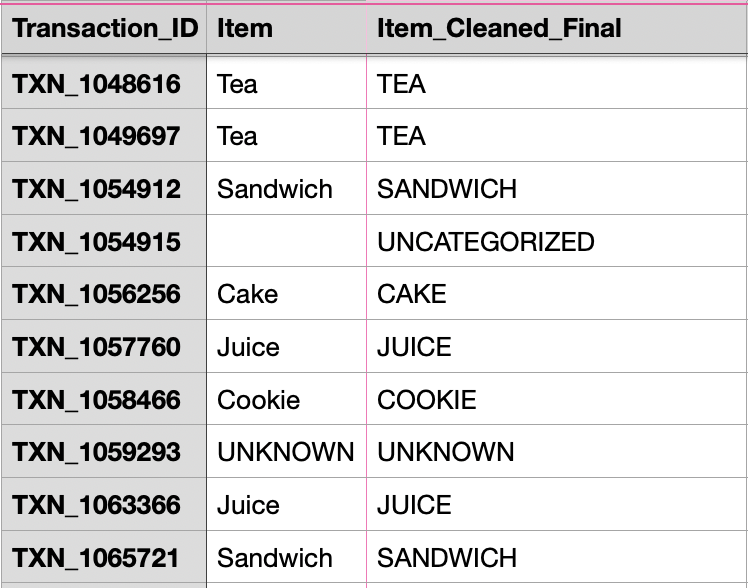
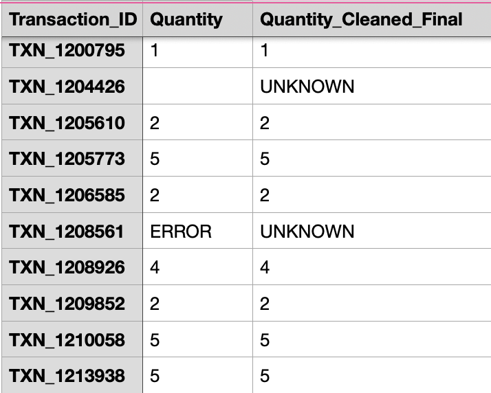
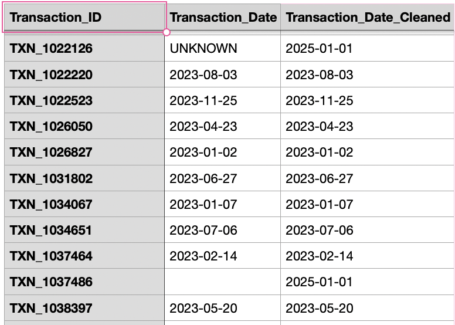
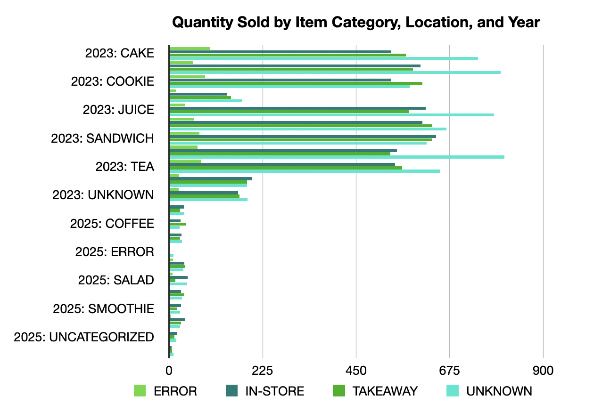
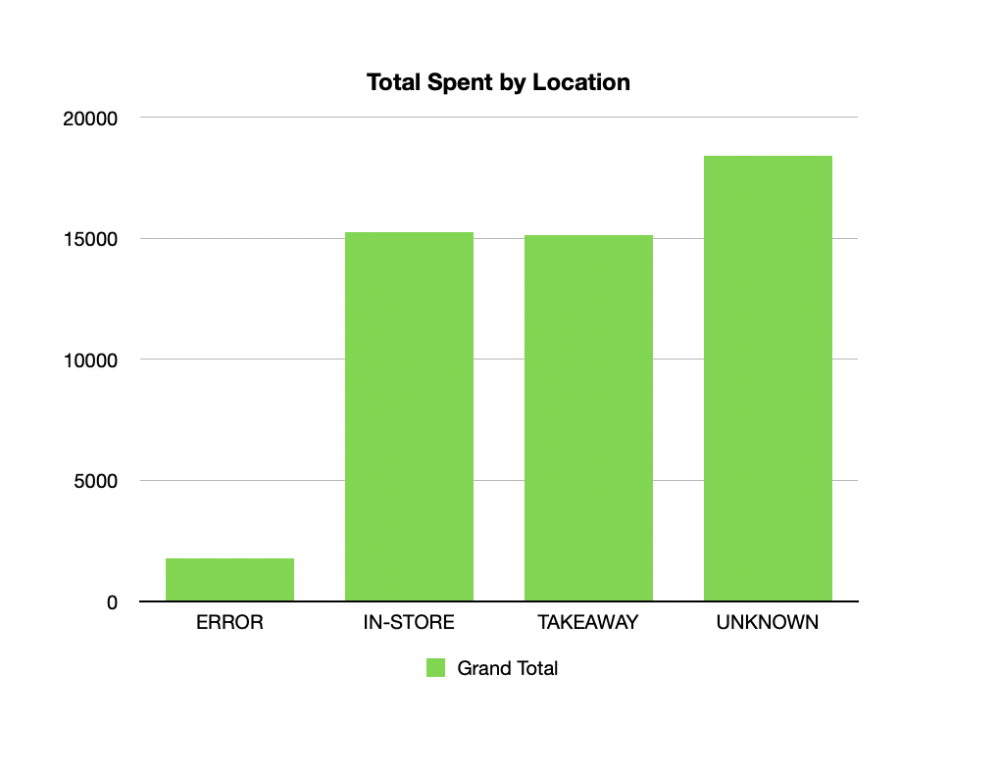
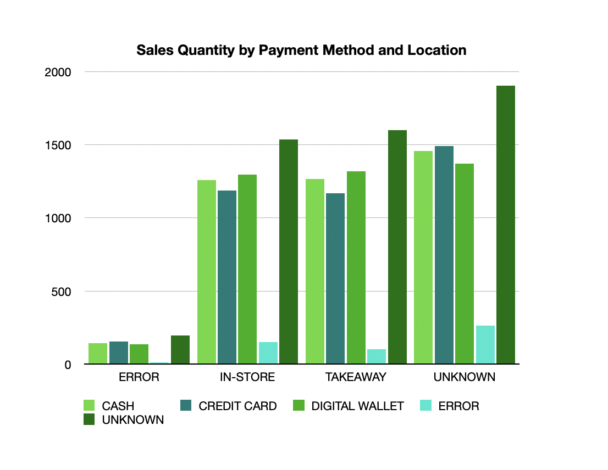
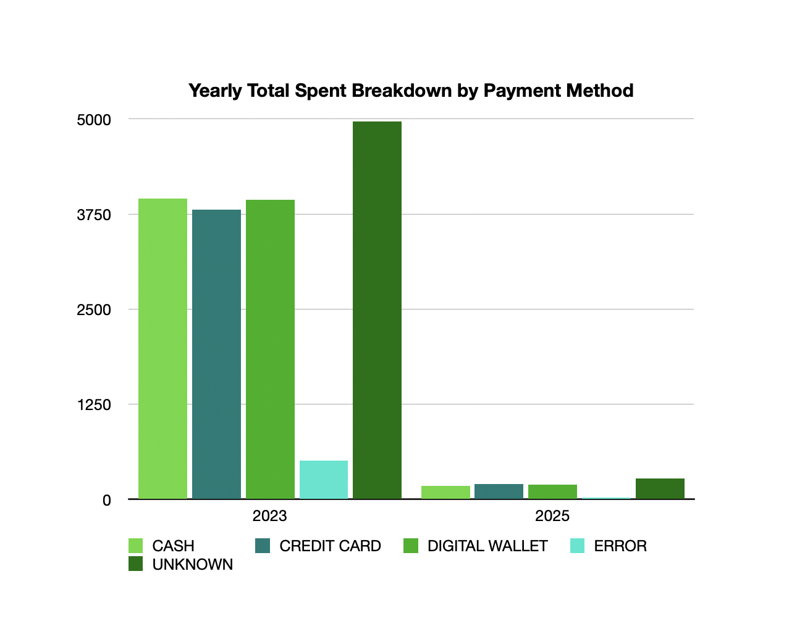

# Cafe Sales Data Cleaning & Analysis (Apple Numbers)

### Overview
I transformed a messy cafe sales dataset into a fully traceable, analysis-ready dataset.

### Dataset Description
The dataset contains cafe transaction records with the following fields:
- Item
- Quantity
- Price Per Unit
- Total Spent
- Payment Method
- Location
- Transaction Date

The raw data contains common real-world issues, including missing values, numbers stored as text, inconsistent capitalization, and invalid entries.

### Issues Identified
- Blank and inconsistent item names
- Quantity and price stored as text
- Invalid values such as "Error" and "Unknown"
- Incorrect or misleading Total Spent values
- Inconsistent capitalization in text fields
- Missing or invalid transaction dates

### Cleaning Approach
- Preserved all raw columns
- Created cleaned columns using formulas
- Standardized text (trimmed spaces, uppercase)
- Converted numeric text into numbers
- Labeled missing or invalid values as "UNKNOWN"
- Recalculated Total Spent only when inputs were valid
- Hid raw columns for a clean, analysis-ready view

This mirrors how I work with data. Raw data is always kept for traceability, and cleaned data is ready for reporting and analysis.

### Key Formulas Used

### Quantity_Cleaned_Final
```text
=IF(TRIM(F2)="","UNKNOWN",
   IF(ISNUMBER(VALUE(TRIM(F2))), VALUE(TRIM(F2)), "UNKNOWN"))
```

### Price_Per_Unit_Final
```text
=IF(TRIM(J2)="","UNKNOWN",
   IF(ISNUMBER(VALUE(TRIM(J2))), VALUE(TRIM(J2)), "UNKNOWN"))
```

### Total_Spent_Final
```text
=IF(OR(I2="UNKNOWN", L2="UNKNOWN"), "UNKNOWN", I2 * L2)
```

### Text Standardization (Item, Location, Payment Method)
```text
=IF(TRIM(A2)="","UNKNOWN", UPPER(TRIM(A2)))
```

## Before & After Examples

<figure>
 <figcaption>Item Cleaning (Before & After)</figcaption>
   
</figure>

<figure>
<figcaption>Quantity Cleaning (Before & After)</figcaption>
   
</figure>

<figure>
<figcaption>Price Per Unit Cleaning (Before & After)</figcaption>
   
</figure>

<figure>
 <figcaption>Total Spent Calculation (Before & After)</figcaption>
  
</figure>

<figure>
 <figcaption>Location & Payment Method Standardization (Before & After)</figcaption>
   
</figure>

<figure>
   <figcaption>Transaction Date Formatting (Before & After)</figcaption>
   
</figure>

### Files in This Repository
```
/data
  Cafe_Sales_Raw.numbers
  Cafe_Sales_Cleaned.numbers
/screenshots
  01_item_cleaning.png
  02_quantity_cleaning.png
  03_price_cleaning.png
  04_total_spent.png
  05_location_payment.png
  06_transaction_date.png
README.md
```

### Outcome
Clean, consistent, and analysis-ready dataset with documented, reproducible spreadsheet transformations.

### Next Steps

Voilà! With the cleaned dataset, we can now:

- Analyze sales and generate reports
- Create visualizations and dashboards
- Import the data into SQL, Python, or BI tools for further analysis

### Data Visualizations

I used pivot tables in Apple Numbers to summarize the cleaned data and created bar charts to highlight insights.

<figure>
  <figcaption>Quantity Sold by Item Category, Location, and Year</figcaption>
  
</figure>

<figure>
  <figcaption>Total Spent by Location</figcaption>
  
</figure>

<figure>
  <figcaption>Sales Quantity by Payment Method and Location</figcaption>
  
</figure>

<figure>
  <figcaption>Yearly Total Spent Breakdown by Payment Method</figcaption>
  
</figure>

These charts highlight sales trends across locations, payment methods, item categories, and years.
